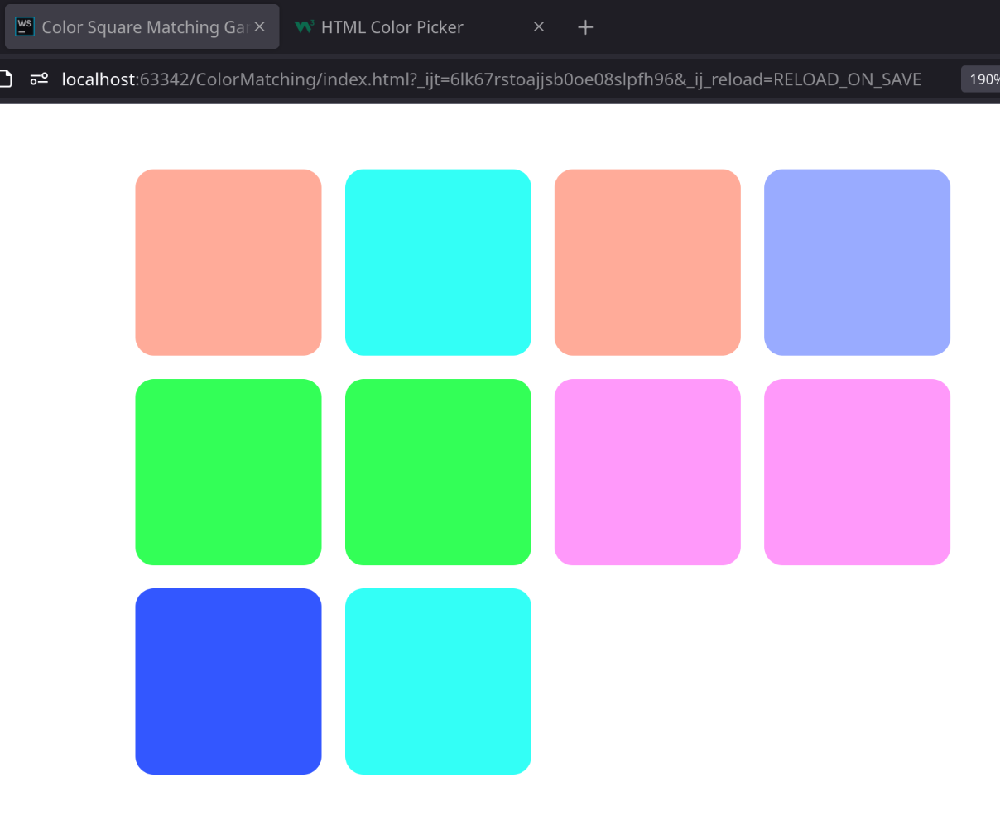

# Color Match Game

Build a game with JavaScript where players match colored squares to clear the board.

## Features

- 10 colored squares (5 pairs of matching colors)
- Tracks when squares are selected. 
  - Figure out if two selected squares match. 
- Win condition detection

## Setup

1. Download Starter code (.zip) unzip folder.
2. Open the project in a code editor (VSCode).
3. Look over starter code.

## Development

I have given you some starter code. 
Use it to aid development. 
Or feel free to start with a clean slate. 

- Build an array of 10 colors (5 pairs of 2). Store colors has [Hex Colors](https://www.w3schools.com/colors/colors_picker.asp) strings. 
- Build an `initializeGame()` function.
  - Find `game-container` area in DOM. 
  - Fill the `game-container` squares. Make sure to attach a click handler and class name.
- Build event method attached to each square `handleSquareClick()`. 
  - Method should be able to handle if it's the first selected square or second. 
  - Checks match. 

## UI

This is an example of what the page should look like. 
Feel free to go wild with stylizing it. 

